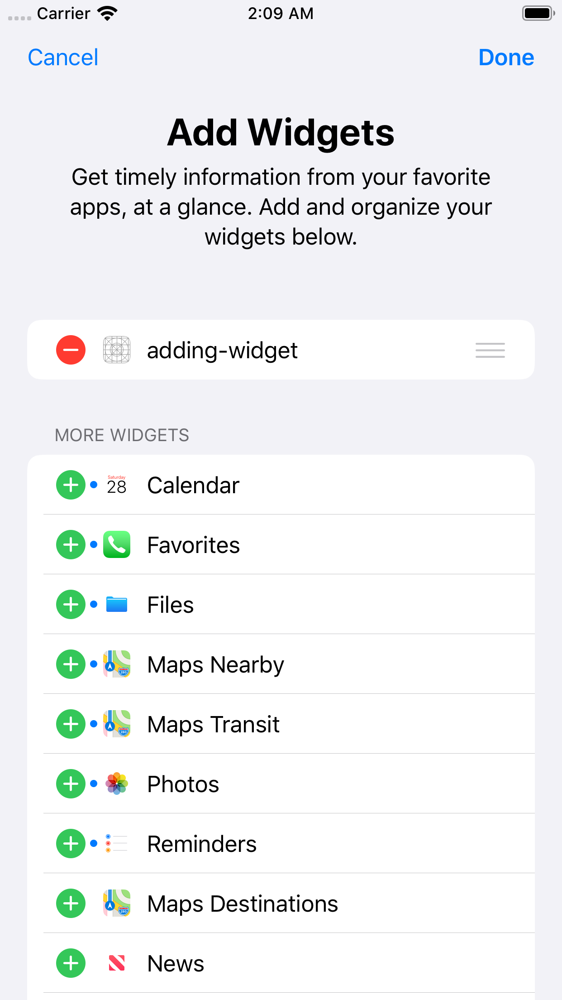
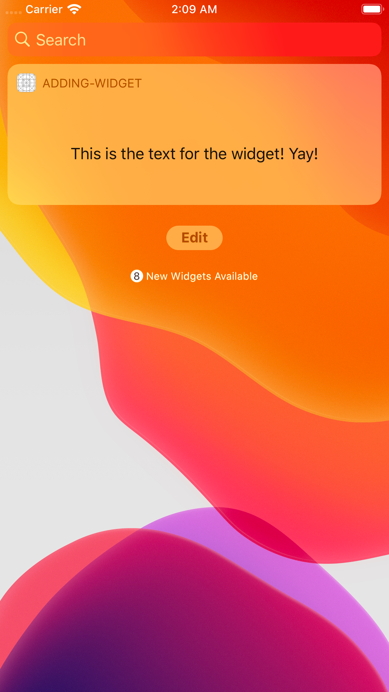

# Adding a Basic notification centre widget to an app

How to create a notification centre widget for an app.

## Notes

- Create a new single view application.
- Add new target (File > New > Target > Today View Controller)
- Swift file and storyboard for widget located in adding-widget folder in project
- From here you can edit the storyboard as you would a normal app view storyboard 

## Tech Specs

- Supports iOS 12 and iOS 13
- Swift 5

  
  

